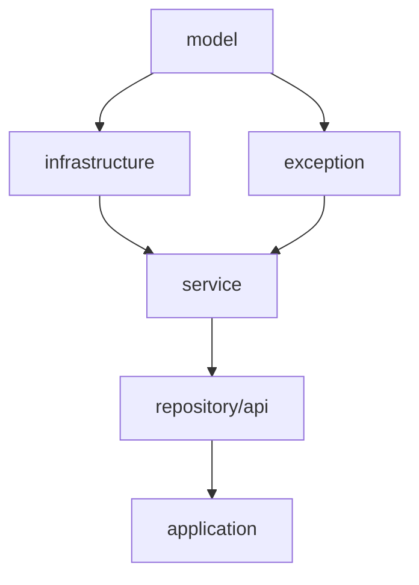

# Multi-Module 헥사고날 아키텍처 가이드

## 멀티 모듈 구조 및 역할

### 1. model
**역할**: 순수 도메인 모델 (가장 내부 계층)
- **의존성**: 없음 (순수 Java)
- **포함 클래스**:
  - `AuditProps.java` - 공통 감사 속성 인터페이스
  - `{Domain}Identity.java` - 도메인 식별자 (Value Object)
  - `{Domain}Model.java` - 도메인 인터페이스
  - `{Domain}.java` - 도메인 구현체 (불변 객체)

### 2. exception
**역할**: 도메인별 예외 정의
- **의존성**: 없음
- **포함 클래스**:
  - `{Domain}{ExceptionType}Exception.java` (예: `FooNotFoundException`, `FooAlreadyExistsException`)
  - RuntimeException을 상속하는 도메인 예외들

### 3. infrastructure
**역할**: 포트(Port) 인터페이스 정의 (헥사고날의 경계)
- **의존성**: model, exception
- **포함 클래스**:
  - `{Domain}Repository.java` - Repository 인터페이스 (CRUD 메서드 정의)

### 4. service
**역할**: 비즈니스 로직 구현
- **의존성**: model, exception, infrastructure
- **포함 클래스**:
  - `{Domain}LookUpService.java` - 비즈니스 로직 서비스
  - 입력값 검증, 비즈니스 규칙 적용, 트랜잭션 관리

### 5. repository-jdbc
**역할**: JDBC 기반 어댑터 구현 (외부 계층)
- **의존성**: infrastructure
- **포함 클래스**:
  - `{Domain}JdbcRepository.java` - Repository 인터페이스 구현체
  - `{Domain}Entity.java` - 데이터베이스 매핑용 엔티티 (선택적)
  - `{Domain}RowMapper.java` - ResultSet → Domain 객체 변환기

### 6. api
**역할**: REST API 어댑터 (외부 계층)
- **의존성**: service
- **포함 클래스**:
  - `{Domain}ApiController.java` - REST API 컨트롤러
  - `dto/{Domain}Response.java` - API 응답 DTO
  - `dto/{Domain}CreateRequest.java` - 생성 요청 DTO
  - `dto/{Domain}UpdateRequest.java` - 수정 요청 DTO

### 7. application-api
**역할**: 실행 가능한 Spring Boot 애플리케이션
- **의존성**: 모든 모듈
- **포함 내용**: Main 클래스, 설정 파일

## 제공하는 스크립트 종류

### 프로젝트 초기화 스크립트
| 스크립트 | 용도 | 파라미터 |
|---------|------|----------|
| `init_multimodule_project.md` | 새 멀티모듈 프로젝트 생성 | 프로젝트명, 루트모듈명, 패키지명 |

### 모듈별 초기화 스크립트 (빈 프로젝트용)
| 스크립트                                      | 용도                     | 대화형 | 비고 |
|-------------------------------------------|------------------------|--------|------|
| `init_model_module.md`                    | Model 모듈 초기화           | ❌ | Example 도메인 포함 |
| `init_exception_module.md`                | Exception 모듈 초기화       | ❌ | ExampleNotFoundException 포함 |
| `init_infrastructure_module.md`           | Infrastructure 모듈 초기화  | ❌ | ExampleRepository 인터페이스 |
| `init_service_module.md`                  | Service 모듈 초기화         | ❌ | ExampleLookUpService |
| `init_repository_jdbc_module.md`          | Repository-JDBC 모듈 초기화 | ❌ | JDBC 구현체들 |
| `init_api_module.md`                      | API 모듈 초기화             | ❌ | REST API + DTO들 |
| `init_application_api_module.md`          | Application 모듈 초기화     | ❌ | Spring Boot 메인 클래스 |
| `run add_schema_module.md  도메인명: example` | ddl , 초기 데이터 생성        | ❌ |  |

### 도메인 코드 추가 스크립트 (기존 프로젝트용)
| 스크립트 | 용도 | 대화형 | 2-depth 지원 | 생성 파일 수 |
|---------|------|--------|-------------|-------------|
| `add_domain_to_model.md` | 도메인 모델 추가 | ✅ | ❌ | 3개 |
| `add_domain_to_exception.md` | 도메인 예외 추가 | ✅ | ❌ | 1개 |
| `add_domain_to_infrastructure.md` | Repository 인터페이스 추가 | ✅ | ✅ | 1~N개 |
| `add_domain_to_service.md` | 비즈니스 서비스 추가 | ✅ | ✅ | 1~N개 |
| `add_domain_to_repository_jdbc.md` | JDBC 구현체 추가 | ✅ | ✅ | 3~3N개 |
| `add_domain_to_api.md` | REST API 추가 | ✅ | ✅ | 4~4N개 |

## 대화형 스크립트 특징

### 공통 입력 프로세스
1. **프로젝트 정보 자동 감지**: settings.gradle.kts, build.gradle.kts 분석
2. **도메인명 입력**: PascalCase 검증 (예: User, Product, OrderItem)
3. **하위 엔티티 입력** (2-depth 지원 스크립트만):
   - 빈 입력: 도메인 자체 (예: User → UserRepository)
   - 단일 입력: 하나의 하위 엔티티 (예: Profile → UserProfileRepository)
   - 다중 입력: 여러 하위 엔티티 (예: Profile,Setting → UserProfileRepository, UserSettingRepository)
4. **의존성 검증**: 필수 모듈/클래스 존재 확인
5. **최종 확인**: 생성될 파일 목록 표시 후 사용자 승인

### 입력 검증 규칙
- **도메인명**: PascalCase, 영문자만, 첫 글자 대문자
- **하위 엔티티**: PascalCase, 쉼표로 구분, 공백 허용
- **의존성**: 이전 계층 모듈의 관련 클래스 존재 확인

## 헥사고날 아키텍처 의존성 방향

**규칙**:
- 내부 계층은 외부 계층을 모르고
- 외부 계층은 내부 계층에 의존
- repository-jdbc와 api는 같은 레벨 (둘 다 service에 의존)