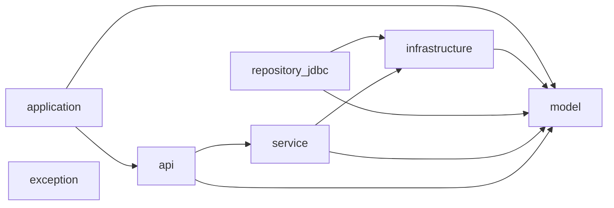

# .claude/tasks/multi_module 문서 (초안)

> 본 문서는 **Claude Code** 환경에서 사용되는 멀티모듈 스캐폴딩 태스크(.claude/tasks/multi_module)의 목적, 사용법, 생성되는 모듈 구조를 정의합니다. 레포지토리/팀 컨벤션에 맞춰 필요한 항목을 채워 넣으세요.

---

## 0. Claude Code Script 설명

### 0.1 목적
이 스크립트는 **반복 작업을 자동화**하여 개발자의 피로도를 줄이는 데 목적이 있습니다. 멀티모듈 프로젝트에서 단순 CRUD 도메인만 추가하더라도 `model`, `infra`, `api`, `jdbc` 등 여러 계층의 보일러플레이트 코드가 필요합니다. 이 스크립트는 이러한 초기 CRUD용 코드를 자동으로 생성해 줍니다.

### 0.2 LLM 활용 차별점
전통적인 셸 스크립트와 달리, 본 스크립트는 **LLM 도구를 연계**하여 다음을 지원합니다:
- **빌드/테스트 가능한 코드** 자동 생성
- 레퍼런스 클래스 추정 및 의미 기반 함수 호출 연결
- 단순 구현체와 테스트 코드의 자동 작성
- 패키지 depth가 깊어져도 자연어로 요청 가능 (예: `run add_model_module 도메인: Foo, 공용 Utils의 rowMapper 사용해라 / 말아라`)

### 0.3 기본 기능
- 멀티 모듈 세팅의 **초기 구조 자동화**
- CRUD 보일러플레이트 제공
- LLM을 통한 쉬운 호출, 프롬프트에 래퍼런스할 클래스를 추론

---

## 1. 사용법

### 1.1 준비 사항
1. **Claude Code 설치 및 실행**
2. 현재 레포의 `.claude` 디렉터리 및 하위 파일들을 **프로젝트 루트에 복사** ( 프로젝트에 zip 파일 푸셔서 쓰셔도 됩니다. )
3. 프로젝트에 `gradlew` (Gradle Wrapper) 설치/확인 필요

### 1.2 사용 예시

#### 모듈 전체 초기화
```bash
run init_complete_multimodule_project.md

프로젝트명: my-project, 루트모듈: modules, 패키지: com.example.hello
```

> 실행중 .. 서버 상태에 따라 10분 ~ 30분이 걸립니다. 
```
Creating Schema module… (esc to interrupt · ctrl+t to hide todos)
  ⎿  ☒ Phase 1: 프로젝트 기본 구조 생성
     ☒ Phase 2: 기본 모듈들 생성
     ☒ Phase 3: 비즈니스 로직 모듈들 생성
     ☒ Phase 4: 프레젠테이션 계층 생성
     ☐ 8/9 - Schema 모듈 생성
     ☐ 9/9 - Application-API 모듈 생성
     ☐ Phase 6: 프로젝트 구조 상세 출력
```
> 완료 통계


```
⏺ ✅ 완성된 멀티모듈 프로젝트 요약:                                                                                                   12:20 AM  claude-sonnet-4-20250514

  🏗️ 생성된 8개 모듈:
  - model: 도메인 모델 (Example, ExampleIdentity, ExampleModel, AuditProps)
  - exception: 도메인 예외 (ExampleNotFoundException)
  - infrastructure: 포트 인터페이스 (ExampleRepository)
  - service: CQRS 비즈니스 로직 (ExampleReader/Writer + Implementations)
  - repository-jdbc: Spring Data JDBC 어댑터 (ExampleJdbcRepository, ExampleEntity)
  - api: REST API (ExampleApiController, ExampleResponse, GlobalExceptionHandler)
  - schema: H2 데이터베이스 스키마 + 테스트 데이터
  - application-api: 통합 Spring Boot 애플리케이션 (중앙화된 컴포넌트 스캔)

  📊 프로젝트 통계:
  - 총 19개 Java 파일, 10개 Kotlin 빌드 스크립트, 10개 리소스 파일
  - 헥사고날 아키텍처 기반 설계
  - 중앙집중식 컴포넌트 스캔 정책
  - 모듈별 패키지 분리 (com.example.hello.*)
  
  
⎿  modules                                                                     
     ├── api
     │   ├── build.gradle.kts
     │   └── src
     │       └── main
     │           ├── java
     │           │   └── com
     │           │       └── example
     │           │           └── hello
     │           │               └── api
     │           │                   ├── config
     │           │                   │   ├── ApiAutoConfiguration.java
     │           │                   │   └── GlobalExceptionHandler.java
     │           │                   └── example
     │           │                       ├── ExampleApiController.java
     │           │                       └── dto
     │           │                           └── ExampleResponse.java
     │           └── resources
     ├── application-api
     │   ├── build.gradle.kts
     │   └── src
     │       └── main
     │           ├── java
     │           │   └── com
     │           │       └── example
     │           │           └── hello
     │           │               └── application
     │           │                   └── QuickMultimoduleApplication.java
     │           └── resources
     │               └── application.yml
     ├── exception
     │   ├── build.gradle.kts
     │   └── src
     │       └── main
     │           └── java
     │               └── com
     │                   └── example
     │                       └── hello
     │                           └── exception
     │                               └── ExampleNotFoundException.java
     ├── infrastructure
     │   ├── build.gradle.kts
     │   └── src
     │       └── main
     │           └── java
     │               └── com
     │                   └── example
     │                       └── hello
     │                           └── infrastructure
     │                               └── example
     │                                   └── repository
     │                                       └── ExampleRepository.java
     ├── model
     │   ├── build.gradle.kts
     │   └── src
     │       └── main
     │           └── java
     │               └── com
     │                   └── example
     │                       └── hello
     │                           └── model
     │                               ├── AuditProps.java
     │                               └── example
     │                                   ├── Example.java
     │                                   ├── ExampleIdentity.java
     │                                   └── ExampleModel.java
     ├── repository-jdbc
     │   ├── build.gradle.kts
     │   └── src
     │       └── main
     │           ├── java
     │           │   └── com
     │           │       └── example
     │           │           └── hello
     │           │               └── jdbc
     │           │                   ├── config
     │           │                   │   └── JdbcRepositoryAutoConfiguration.java
     │           │                   └── example
     │           │                       └── repository
     │           │                           ├── ExampleEntity.java
     │           │                           ├── ExampleEntityRepository.java
     │           │                           └── ExampleJdbcRepository.java
     │           └── resources
     ├── schema
     │   ├── build.gradle.kts
     │   └── src
     │       └── main
     │           └── resources
     │               ├── data.sql
     │               └── schema.sql
     └── service
         ├── build.gradle.kts
         └── src
             └── main
                 └── java
                     └── com
                         └── example
                             └── hello
                                 └── service
                                     └── example
                                         ├── ExampleReader.java
                                         ├── ExampleWriter.java
                                         └── impl
                                             ├── DefaultExampleReader.java
                                             └── DefaultExampleWriter.java 
```

#### 개별 도메인 초기화 예시 

다른 모듈별 작업은 .claude/tasks/multi_module/init 하위의 스크립트를 참고해주세요. 
```bash
run init_model_module.md
```

#### 도메인별 코드 추가
다른 모듈별 작업은 .claude/tasks/multi_module/add 하위의 스크립트를 참고해주세요.
```bash
run add_domain_to_infrastructure.md
```


#### 테스트 코드 추가  

다른 모듈별 작업은 .claude/tasks/multi_module/test 하위의 스크립트를 참고해주세요.

```bash
run add_api_test.md 
```

### 1.3 가이드 문서
자세한 사용법은 `.claude/guide.md` 또는 각 개별 스크립트를 확인하세요. 팀/개발자 스타일에 따라 약간씩 **커스텀해서 사용하는 것**을 권장합니다.

---

## 2. 모듈 구조 및 역할 (요약)

### 2.1 모듈별 설명
- **model**: 도메인 모델, 밸류 객체, 비즈니스 규칙 중심
- **api**: 외부/내부와의 계약(인터페이스, DTO 등)
- **application**: 서비스·유스케이스 계층, 흐름 제어
- **infrastructure**: 외부 연결 어댑터 (DB, 메시징 등 구현)
- **repository_jdbc**: `api`의 리포지토리 인터페이스를 JDBC 방식으로 구현한 하위 모듈
- **exception**: 공통 예외 및 오류 처리 클래스 모음

### 2.2 의존 관계 (Mermaid)


### 2.3 의존 규칙 요약
- `application` 계층은 `api`와 `model`을 참조
- `infrastructure`는 `api`와 `model`을 참조하며 구현체 제공
- `repository_jdbc`는 `api` 인터페이스 구현체로서 `api`, `model` 참조
- 모든 모듈은 공통 `exception`을 참조할 수 있음

